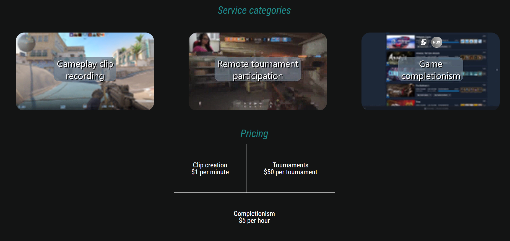

# Nyx Gaming - Landing page

### Subject: Web programming

Nowadays gaming has gotten really popolar. A lot of young boys and girls like spending their free time playing with their friends, or even enjoying a very nice story. As such, there are some people that do not have a lot of time to spare on games.

Here's where the idea comes. As they grow up, free time becomes limited, but the desire to stay on top and have a name persists for a lot of young adults. But hey, we're not blaming them.

Introducing *Nyx Gaming*. It is a service that helps anyone stay on top of the leaderboards and prove themselves to the world, just a couple of clicks away.

Here's a live link to the website: https://g4mrpr0n.github.io/tum-web-lab2/

